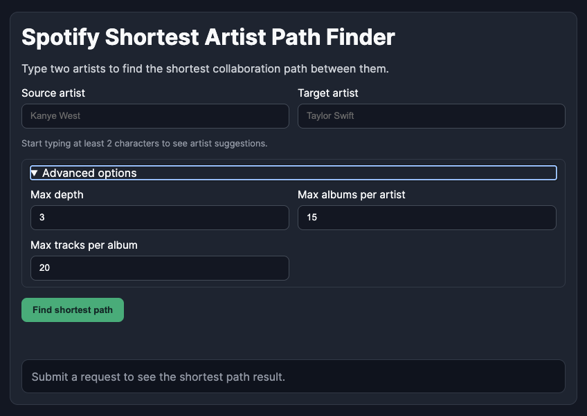
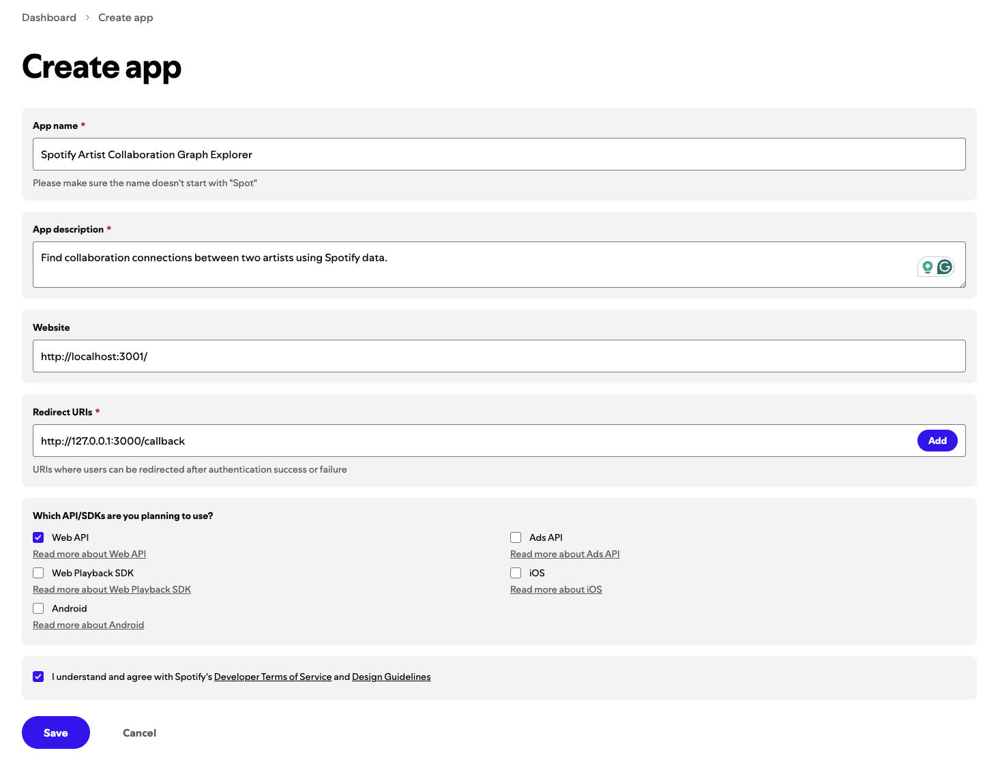
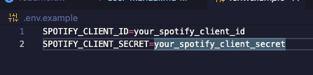
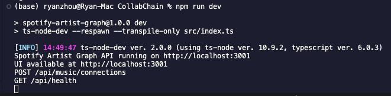
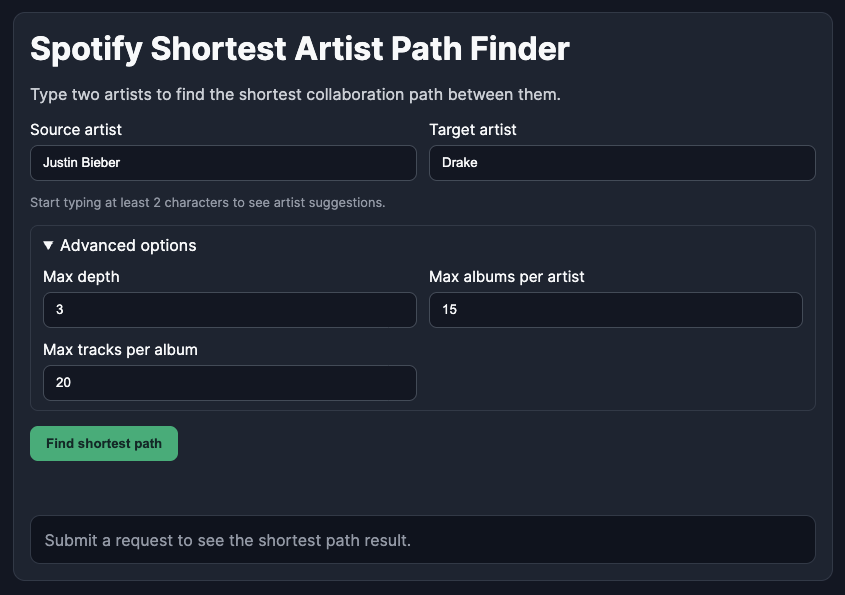
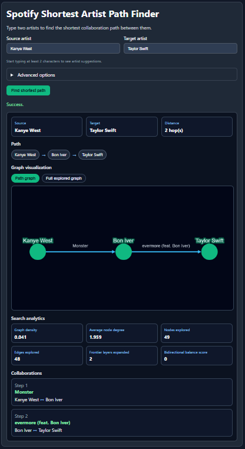
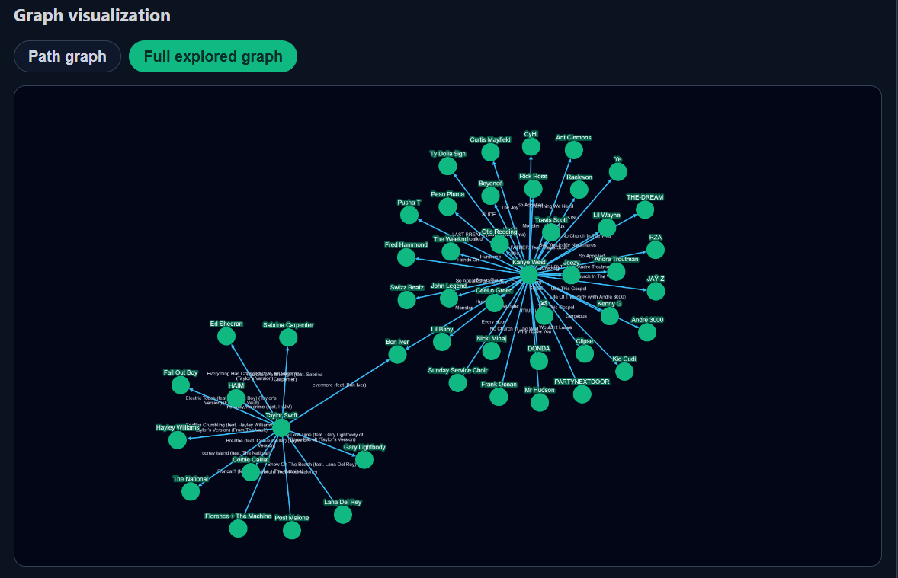

# Spotify Shortest Artist Path Finder - User Manual

## Overview
This application finds the shortest collaboration path (in hops) between two artists using Spotify data.
It models artists as graph nodes and collaborations as graph edges, then runs bidirectional BFS to find a path.
The web app also includes graph visualization and search analytics for the explored network.



## 1. Prerequisites
- Node.js (recommended: current LTS)
- npm (comes with Node.js)
- Internet connection (Spotify API is required)

## 2. Get Spotify API Credentials
1. Go to Spotify for Developers: <https://developer.spotify.com/dashboard>
2. Log in and create a new app.
3. Copy your **Client ID** and **Client Secret**.



## 3. Project Setup
From the project root:

1. Install dependencies:
   ```bash
   npm install
   ```
2. Create your environment file from the template:
   ```bash
   cp .env.example .env
   ```
3. Open `.env` and set your credentials:
   ```env
   PORT=3001
   SPOTIFY_CLIENT_ID=your_client_id_here
   SPOTIFY_CLIENT_SECRET=your_client_secret_here
   ```



## 4. Run the Program
Option A (development mode):
```bash
npm run dev
```

Option B (build + production start):
```bash
npm run build
npm start
```

Then open:
<http://localhost:3001>



## 5. Using the Website
1. Enter a **Source artist** and **Target artist**.
2. Use autocomplete suggestions while typing.
3. Expand **Advanced options** if needed:
   - **Max depth**: maximum hop limit
   - **Max albums per artist**: how many albums are scanned per artist
   - **Max tracks per album**: how many tracks are scanned per album
4. Click **Find shortest path**.



## 6. Understanding Results
After a successful search, the page shows:

### A) Summary
- Source
- Target
- Distance (hop count)

### B) Path
- Ordered artist chain from source to target

### C) Graph visualization
- **Path graph**: shows shortest path structure
- **Full explored graph**: shows the BFS explored subgraph

### D) Search analytics
- Graph density
- Average node degree
- Nodes explored
- Edges explored
- Frontier layers expanded
- Bidirectional balance score

### E) Collaborations
- Step-by-step track/artist pair used for each edge in the returned path




## 7. Tips for Better Results
- If no path is found, increase:
  - Max depth
  - Max albums per artist
  - Max tracks per album
- Start with well-known artists if testing quickly.
- If search is slow, reduce advanced limits.

## 8. Troubleshooting
- **Missing Spotify credentials**
  Check `SPOTIFY_CLIENT_ID` and `SPOTIFY_CLIENT_SECRET` in `.env`.
- **Timeout / no result**
  Increase search limits or try a different artist pair.
- **App not updating after code changes**
  Restart the server and hard refresh browser (`Cmd+Shift+R` on macOS).
- **Port conflict**
  Change `PORT` in `.env` and restart.

## 9. Optional API Endpoints
- `GET /api/health`
- `GET /api/music/artists/search?q=<artist name>`
- `POST /api/music/connections`
